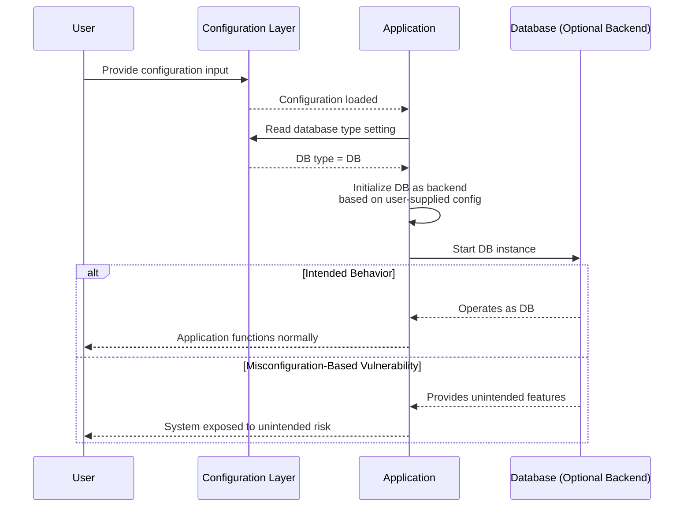

# MSCCS :: RCE In Apache NiFi

### Introduction:

TODO

### Software:

- **Name:** Apache NiFi
- **Language:** Java
- **URL:** https://github.com/apache/nifi

### Weakness:

- <a href="https://cwe.mitre.org/data/definitions/20.html">CWE-20: Improper Input Validation</a>
- <a href="https://cwe.mitre.org/data/definitions/89.html">CWE-15: External Control of System or Configuration Setting</a>

The first weakness exists when application's server component fails to properly validate untrusted user-controlled input leading to unexpected or undesirable outcomes on the server. 

The second weakness occurs when the aformentioned untrusted input is provided as configuration to select a database driver. This external configuration allows for the user the dynamically control which backend driver the application will load, which can lead to unintended behavior



### Vulnerabilty:

<a href="https://www.cve.org/CVERecord?id=CVE-2023-34468">CVE-2023-34468</a> - Published 12 June 2023, Updated 28 September 2023

Apache NiFi is an open-source, distrubuted data processing system designed to automate various data flows betwen a wide range of systems. NiFi consists of a highly flexible processor / controller service framework that has fostered a rich ecosystem of pre-built components to interact with common technologies including (but not limited to) database systems, message queues, and APIs.

With this flexibility, comes the inherent risk of vulnerabilites simply due to the sheer attack surface. In 2023, a critical RCE vulnerabilty was found within a core abstraction for several database connector components that affected all major versions dating back to the inital release.

The vulnerability is due to a lack of input validation at the configuration layer for two core database connector components that are implemented as controller services:

- DBCPConnectionPool
- HikariCPConnectionPool

This configuration oversight allowed for the unintended use of the H2 database within the NiFi server's JVM. The H2 database is a lightweight, open-source relational database written in Java. The driver has a commonly used embedded mode, that runs inside the same JVM process as the application. While this functionality is very useful for application development and testing, it is not designed for untrusted environments since it assumes that both the environment and configuration is trusted.

With the ability to interact with an in-memory H2 database running inside the NiFi server's JVM, the user would be able to execute arbitrary Java code due to the database's UDF functionality. The following example is not malicious but illustrates the power of this feature.

```sql
CREATE ALIAS EXEC AS $$
void e(String cmd) throws java.io.IOException {
    java.lang.Runtime rt = java.lang.Runtime.getRuntime();
    rt.exec(cmd);
}
$$;
CALL EXEC('whoami')
```


#### DBCPConnectionPool

For the `DBCPConnectionPool`, the vulnerabilty stems from a lack of input validation on a `PropertyDescriptor` named `DATABASE_URL` within the `DBCPProperties`. This oversight allowed for mallicious use of the H2 database JAR (which is shipped by the default Apache NiFi distribution) to execute arbitrary Java code thus resulting in remote code execution.


```diff
vulnerable file: nifi-nar-bundles/nifi-extension-utils/nifi-dbcp-base/src/main/java/org/apache/nifi/dbcp/utils/DBCPProperties.java

 30 public final class DBCPProperties {
 31    private DBCPProperties() {
 32    }
 33    public static final PropertyDescriptor DATABASE_URL = new PropertyDescriptor.Builder()
 34            .name("Database Connection URL")
 35            .description("A database connection URL used to connect to a database. May contain database system name, host, port, database name and some parameters."
 36                    + " The exact syntax of a database connection URL is specified by your DBMS.")
 37            .defaultValue(null)
-38            .addValidator(StandardValidators.NON_EMPTY_VALIDATOR)
 39            .required(true)
 40            .expressionLanguageSupported(ExpressionLanguageScope.VARIABLE_REGISTRY)
 41            .build();
 ...
```

Per the lack of validation, this input was loaded via nifi's internal `ConfigurationContext` via an abstract function named `getDataSourceConfiguration`. This function was defined in the `AbstractDBCPConnectionPool` class and implemented in the concrete use of the abstraction. 

```diff
file:  nifi-nar-bundles/nifi-extension-utils/nifi-dbcp-base/src/main/java/org/apache/nifi/dbcp/AbstractDBCPConnectionPool.java

 81        final BasicDataSource dataSource = new BasicDataSource();
 82       try {
-83           final DataSourceConfiguration configuration = getDataSourceConfiguration(context);
 84           configureDataSource(context, configuration);

 ...

-158     protected abstract DataSourceConfiguration getDataSourceConfiguration(final ConfigurationContext context);
```

In the case of this vulnerabilty, it was utilized by the `DBCPConnectionPool` which provides an interface for database connection pooling.

```diff
file: nifi-nar-bundles/nifi-standard-services/nifi-dbcp-service-bundle/nifi-dbcp-service/src/main/java/org/apache/nifi/dbcp/DBCPConnectionPool.java

 210    @Override
 211   protected DataSourceConfiguration getDataSourceConfiguration(ConfigurationContext context) {
-212       final String url = context.getProperty(DATABASE_URL).evaluateAttributeExpressions().getValue();
-213       final String driverName = context.getProperty(DB_DRIVERNAME).evaluateAttributeExpressions().getValue();
 ...
```

From there the `DataSourceConfiguration` is used to build a `BasicDataSource` instance variable for the `AbstractDBCPConnectionPool` which is used to fetch `java.sql.Connection` objects from the underlying datasource via the `getConnection` method. 

```diff
 160 protected void configureDataSource(final ConfigurationContext context, final DataSourceConfiguration configuration) {
-161       final Driver driver = getDriver(configuration.getDriverName(), configuration.getUrl());
 162
-163       dataSource.setDriver(driver);

 ...

 220    @Override
 221   public Connection getConnection() throws ProcessException {
-222       return getConnection(dataSource, kerberosUser);
 223   }
 224
 225   private Connection getConnection(final BasicDataSource dataSource, final KerberosUser kerberosUser) {
 226       try {
 227           final Connection con;
 228           if (kerberosUser != null) {
 229               KerberosAction<Connection> kerberosAction = new KerberosAction<>(kerberosUser, dataSource::getConnection, getLogger());
 230              con = kerberosAction.execute();
 231           } else {
-232               con = dataSource.getConnection();
 233           }
 234           return con;
 ...
```

With all of this, NiFi is now going to interface with a SQL driver provided by the user regardless of what driver the user has selected. This exposes the underlying vulnerability, due to the H2 database JAR being on the runtime classpath of the NiFi application.

#### HikariCPConnectionPool

Additionally, an implementation of the `DBCPService` interface named `HikariCPConnectionPool` was vulnerable due to the same validation mistake. I am not going to go into the same detail of how this input is utilized within this service, although it is very similar to the `DBCPConnectionPool`.

```diff
vulnerable file: nifi-nar-bundles/nifi-standard-services/nifi-dbcp-service-bundle/nifi-hikari-dbcp-service/src/main/java/org/apache/nifi/dbcp/HikariCPConnectionPool.java

 63 public class HikariCPConnectionPool extends AbstractControllerService implements DBCPService {
 64   /**
 65    * Property Name Prefix for Sensitive Dynamic Properties
 66    */
 67   protected static final String SENSITIVE_PROPERTY_PREFIX = "SENSITIVE.";
 68  protected static final long INFINITE_MILLISECONDS = -1L;
 69   private static final String DEFAULT_TOTAL_CONNECTIONS = "10";
 70   private static final String DEFAULT_MAX_CONN_LIFETIME = "-1";
 71   public static final PropertyDescriptor DATABASE_URL = new PropertyDescriptor.Builder()
 72           .name("hikaricp-connection-url")
 73           .displayName("Database Connection URL")
 74           .description("A database connection URL used to connect to a database. May contain database system name, host, port, database name and some parameters."
 75                   + " The exact syntax of a database connection URL is specified by your DBMS.")
 76           .defaultValue(null)
-77           .addValidator(StandardValidators.NON_EMPTY_VALIDATOR)
 78           .required(true)
```

### Exploit:

### Fix:

### Prevention:

### Conclusion:

### References:

Apache NiFi Security Reporting: https://nifi.apache.org/documentation/security/

Apache NiFi v1.22.0 Release Notes: https://issues.apache.org/jira/secure/ReleaseNote.jspa?projectId=12316020&version=12353069

JIRA Issue: https://issues.apache.org/jira/browse/NIFI-11653

Patch Pull Request: https://github.com/apache/nifi/pull/7349/commits/6e064a8bdef1cd4f91ea8f42ee16a3675d2f9a9d

### Contributions:
